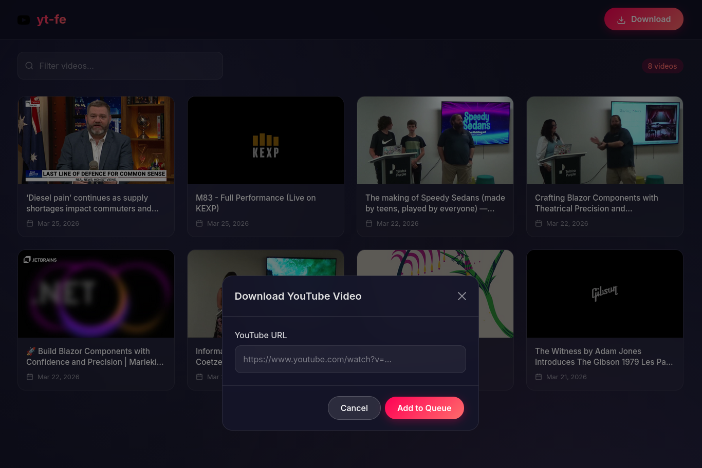

# yt-fe

> **Warning:** This application was created with the assistance of an AI coding agent. Use at your own risk.

A self-hosted YouTube video downloader and viewer frontend. Download YouTube videos, store them locally, and stream them through a modern web interface.



## Features

- Download YouTube videos via URL
- Stream videos directly in-browser
- Video library with thumbnails and search
- Automatic thumbnail generation
- Video conversion to WebM format
- Delete videos with associated files
- Responsive Bootstrap 5 interface

## Prerequisites

### Docker (Recommended)

- Docker
- Docker Compose

### Local Development

- Go 1.26+
- [yt-dlp](https://github.com/yt-dlp/yt-dlp)
- [ffmpeg](https://ffmpeg.org/)

## Quick Start with Docker

```bash
# Clone the repository
git clone <repository-url>
cd yt-fe

# Copy environment template
cp .env.example .env

# Build and start the application
docker-compose up --build

# Or run in detached mode
docker-compose up -d --build
```

The application will be available at `http://localhost:8080`

## Local Development Setup

### Install Dependencies

**yt-dlp:**

```bash
pip install yt-dlp
```

**ffmpeg:**

```bash
# macOS
brew install ffmpeg

# Ubuntu/Debian
apt install ffmpeg

# Arch Linux
pacman -S ffmpeg
```

### Run the Application

```bash
# Install Go dependencies
go mod download

# Build the binary
go build -o yt-fe

# Run
./yt-fe
```

Or use the Makefile:

```bash
make install-deps
make build
make run
```

## Configuration

Environment variables (defaults shown):

| Variable         | Default      | Description                       |
| ---------------- | ------------ | --------------------------------- |
| `PORT`           | `8080`       | HTTP server port                  |
| `VIDEO_DIR`      | `video`      | Directory for downloaded videos   |
| `THUMBNAILS_DIR` | `thumbnails` | Directory for video thumbnails    |
| `METADATA_DIR`   | `metadata`   | Directory for video metadata JSON |

## API Endpoints

| Endpoint                 | Method   | Description                    |
| ------------------------ | -------- | ------------------------------ |
| `/`                      | GET/POST | Main page (download form)      |
| `/download`              | POST     | Add video to download queue    |
| `/video/{filename}`      | GET      | Stream video file              |
| `/thumbnails/{filename}` | GET      | Serve thumbnail image          |
| `/delete/{filename}`     | POST     | Delete video and related files |
| `/api/status`            | GET      | JSON status of download queue  |

## Project Structure

```
yt-fe/
├── main.go           # Main Go application
├── go.mod            # Go module definition
├── config.yaml       # Application configuration
├── Makefile          # Build/run commands
├── Dockerfile        # Multi-stage Docker build
├── docker-compose.yml # Docker orchestration
├── entrypoint.sh     # Docker entrypoint script
├── .env.example      # Environment variables template
├── templates/
│   └── index.html    # Main HTML template
```

## Tech Stack

- **Backend:** Go (pure HTTP server)
- **Frontend:** HTML/CSS/JavaScript with Bootstrap 5
- **Video Processing:** yt-dlp, ffmpeg
