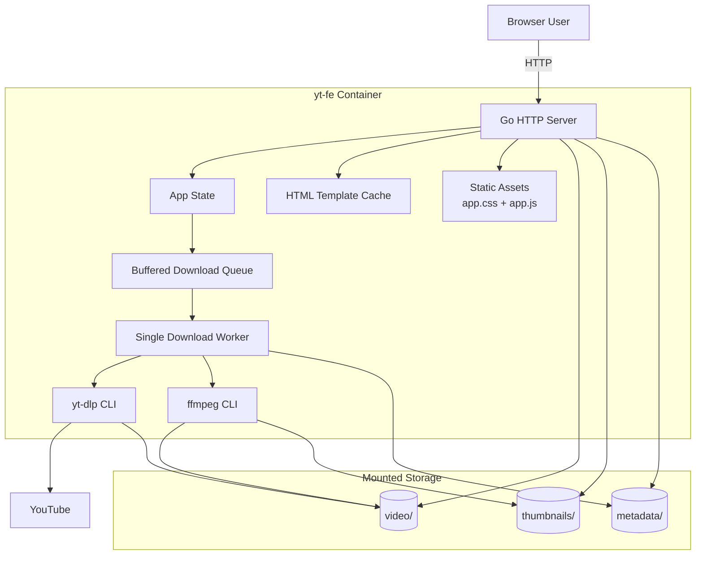
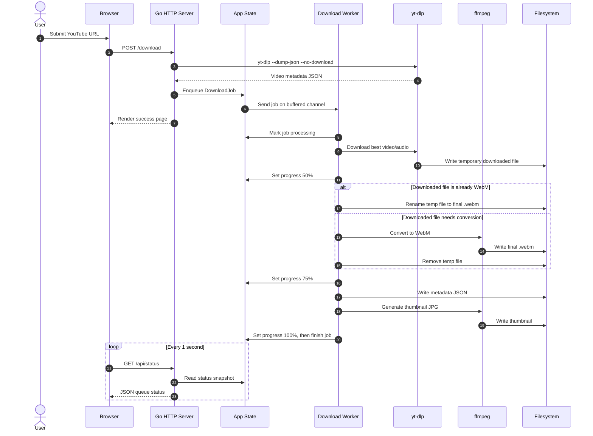
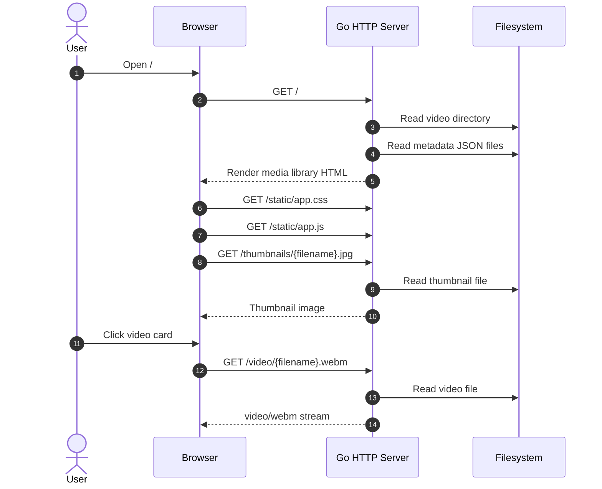
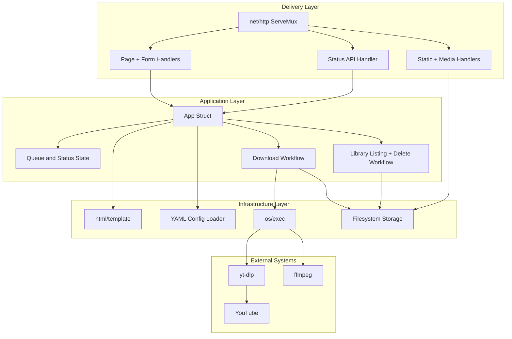

# Technical Design: yt-fe

## Overview

`yt-fe` is a self-hosted Go web application for downloading YouTube videos, storing them locally, and streaming them through a browser-based media library. The application is designed to run as a single containerized server process with local filesystem-backed storage for videos, thumbnails, and metadata.

The current implementation intentionally stays small: one Go binary owns HTTP routing, template rendering, queue state, filesystem operations, and external process orchestration for `yt-dlp` and `ffmpeg`.

## Goals

- Run cleanly as a containerized HTTP server.
- Provide a modern media-library UI for browsing, searching, playing, deleting, and downloading videos.
- Keep runtime dependencies simple: Go binary, `yt-dlp`, `ffmpeg`, and mounted storage directories.
- Preserve downloaded assets on host-mounted volumes.
- Keep the codebase maintainable without introducing a frontend build pipeline or database.

## Non-Goals

- Multi-user authentication or authorization.
- Distributed queueing or multi-worker orchestration.
- Durable job state across process restarts.
- Database-backed persistence.
- Full frontend SPA architecture.

## Runtime Architecture



## Component Diagram

```mermaid
flowchart LR
    subgraph Frontend[Frontend]
        HTML[index.html]
        CSS[static/app.css]
        JS[static/app.js]
        Bootstrap[Bootstrap CDN]
    end

    subgraph Backend[Go Binary]
        Main[main.go\nstartup + route wiring]
        AppState[app.go\nconfig, template, queue state]
        Handlers[handlers.go\nHTTP handlers + workflow functions]
        Config[config.go\nYAML config loading]
        Models[model.go\nDTOs and data models]
    end

    subgraph External[External Processes]
        YTDLP[yt-dlp]
        FFMPEG[ffmpeg]
    end

    subgraph Storage[Filesystem Storage]
        Videos[video/*.webm]
        Thumbnails[thumbnails/*.jpg]
        Metadata[metadata/*.json]
    end

    HTML --> CSS
    HTML --> JS
    HTML --> Bootstrap
    JS -->|POST /download| Handlers
    JS -->|GET /api/status| Handlers
    JS -->|POST /delete/{file}| Handlers
    Main --> AppState
    Main --> Handlers
    AppState --> Config
    Handlers --> Models
    Handlers --> AppState
    Handlers --> YTDLP
    Handlers --> FFMPEG
    Handlers --> Videos
    Handlers --> Thumbnails
    Handlers --> Metadata
```

## Request and Processing Flow

### Download Sequence



### Browse and Playback Sequence



## Architectural Diagram



## Key Components

| Component | Files | Responsibility |
| --- | --- | --- |
| Server bootstrap | `main.go` | Validates required tools, initializes `App`, ensures directories, registers routes, starts HTTP server. |
| App state | `app.go` | Owns configuration, parsed template, buffered job channel, pending jobs, download status, and synchronization. |
| HTTP handlers and workflows | `handlers.go` | Handles page rendering, downloads, queue status, static media serving, deletion, metadata persistence, thumbnail generation, and external process calls. |
| Config | `config.go`, `config.yaml` | Loads YAML configuration with defaults for storage directories. |
| Models | `model.go` | Defines page, video, metadata, job, status, and config data structures. |
| Template | `templates/index.html` | Server-rendered media library markup. |
| Frontend assets | `static/app.css`, `static/app.js` | Styling and browser behavior for search, modal playback, download submission, deletion, and status polling. |
| Container packaging | `Dockerfile`, `docker-compose.yml`, `entrypoint.sh` | Builds the binary, installs `yt-dlp`/`ffmpeg`, exposes the server, and mounts persistent directories. |

## Data Model

| Type | Purpose |
| --- | --- |
| `Video` | View model for a library card: filename, title, thumbnail path, and modification date. |
| `VideoMetadata` | Persisted JSON metadata for a downloaded video. |
| `PageData` | Template payload containing videos and user-facing success/error messages. |
| `DownloadJob` | Queue item containing source URL, YouTube video ID, and target filename. |
| `DownloadStatus` | Snapshot returned by `/api/status`: current job, queued jobs, processing flag, and progress. |
| `Config` | Storage directory configuration. |

## HTTP Interface

| Endpoint | Method | Owner | Description |
| --- | --- | --- | --- |
| `/` | GET | `indexHandler` | Renders the media library. |
| `/` | POST | `indexHandler` | Legacy form submit path; delegates to download handling. |
| `/download` | POST | `downloadHandler` | Validates a URL and enqueues a download job. |
| `/api/formats` | POST | `formatsHandler` | Returns available YouTube quality options before queueing a download. |
| `/api/tags` | GET/POST | `tagsHandler` | Lists or creates global tags in `tags/tags.json`. |
| `/api/tags/{tag}` | PUT/DELETE | `tagHandler` | Renames or deletes a tag and scans metadata for cleanup. |
| `/api/video-tags/{filename}` | GET/POST | `videoTagsHandler` | Reads or replaces tags assigned to one video metadata file. |
| `/api/status` | GET | `apiStatusHandler` | Returns current queue and worker progress as JSON. |
| `/video/{filename}` | GET | `videoHandler` | Streams a local `.webm` video. |
| `/thumbnails/{filename}` | GET | `thumbnailHandler` | Serves a generated thumbnail image. |
| `/delete/{filename}` | POST | `deleteHandler` | Deletes video, thumbnail, and metadata files. |
| `/static/{asset}` | GET | `http.FileServer` | Serves CSS and JavaScript assets. |

## Storage Layout

```text
/app
├── yt-fe
├── templates/
│   └── index.html
├── static/
│   ├── app.css
│   └── app.js
├── video/
│   └── {uuid}.webm
├── thumbnails/
│   └── {uuid}.jpg
└── metadata/
    └── {uuid}.json
```

The `video`, `thumbnails`, and `metadata` directories are expected to be backed by Docker volumes or bind mounts in container deployments.

## Queue and Concurrency Design

- Downloads are processed by a single worker goroutine started at application boot.
- Jobs are submitted through a buffered `chan DownloadJob` with capacity `100`.
- `pendingJobs` and `downloadState` are protected by `statusMutex`.
- `/api/status` returns a cloned snapshot so callers cannot mutate internal state.
- The queue is in-memory only; queued jobs are lost if the process restarts.

## Configuration

The application currently loads storage directories from `config.yaml` with these defaults:

```yaml
video_dir: "video"
thumbnails_dir: "thumbnails"
metadata_dir: "metadata"
```

The HTTP port is read from `PORT`, defaulting to `8080`.

Note: `docker-compose.yml` defines `VIDEO_DIR`, `THUMBNAILS_DIR`, and `METADATA_DIR` environment variables for volume mapping. The Go application currently reads directory paths from `config.yaml`, not those environment variables.

## Error Handling Strategy

- Startup fails fast if `yt-dlp`, `ffmpeg`, template parsing, or directory creation fails.
- Download failures are logged and the worker advances to the next queued job.
- Delete failures return HTTP 500.
- Missing videos or thumbnails return HTTP 404.
- Metadata read failures degrade gracefully by falling back to filename-derived titles.

## Container Design

The Docker image uses a multi-stage build:

- Builder stage: compiles the Go binary.
- Runtime stage: installs `ffmpeg`, Python, `pip`, and `yt-dlp`; copies the binary, templates, static assets, and entrypoint.
- Runtime directories are created under `/app`.
- `docker-compose.yml` maps host directories into `/app/video`, `/app/thumbnails`, and `/app/metadata`.

## Known Tradeoffs

- The code remains in `package main` for simplicity; clearer package boundaries can be introduced later if the app grows.
- External command execution is direct through `os/exec`, which keeps the implementation simple but limits unit-test isolation.
- Queue state is in-memory, so server restarts drop pending jobs.
- Metadata is stored as one JSON file per video rather than in a database.
- The frontend uses plain HTML/CSS/JavaScript and Bootstrap CDN rather than a bundled frontend framework.

## Future Improvements

- Read `VIDEO_DIR`, `THUMBNAILS_DIR`, and `METADATA_DIR` environment variables in `loadConfig` to align runtime config with Docker Compose.
- Split `handlers.go` into smaller files: `library.go`, `downloads.go`, `media_handlers.go`, and `status_handlers.go`.
- Add abstraction around external command execution for unit tests.
- Persist queue state if restart-safe downloads become a requirement.
- Add structured logging and request logging middleware.
- Add HTTP range request support for more efficient video streaming.
